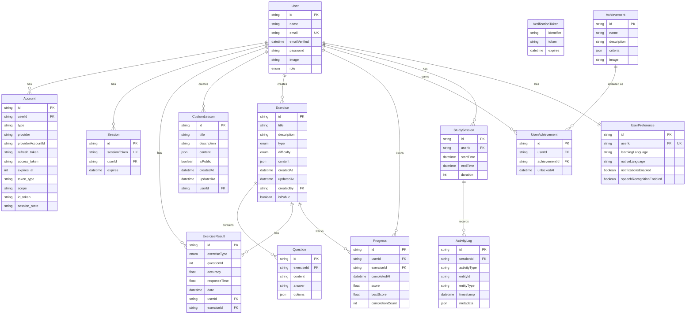

# Sơ đồ Quan hệ Cơ sở Dữ liệu - Hệ thống Quản lý Người dùng

## Mô tả
Sơ đồ dưới đây mô tả mối quan hệ giữa các bảng trong cơ sở dữ liệu của ứng dụng.

## Giải thích Các Quan hệ

### Người dùng và Xác thực
- Một **User** có thể có nhiều **Account** (xác thực bên thứ 3)
- Một **User** có thể có nhiều **Session** (phiên đăng nhập)
- Mỗi **User** có chính xác một **UserPreference** (thiết lập người dùng)

### Người dùng và Nội dung
- Một **User** có thể tạo nhiều **CustomLesson** (bài học tùy chỉnh)
- Một **User** có thể tạo nhiều **Exercise** (bài tập)
- Một **User** có thể có nhiều **ExerciseResult** (kết quả bài tập)

### Người dùng và Tiến độ
- Một **User** có thể có nhiều **Progress** (tiến độ học tập)
- Một **User** có thể đạt được nhiều **UserAchievement** (thành tích)
- Một **User** có thể có nhiều **StudySession** (phiên học tập)

### Bài tập và Câu hỏi
- Một **Exercise** chứa nhiều **Question** (câu hỏi)
- Một **Exercise** có thể có nhiều **ExerciseResult** (kết quả)
- Một **Exercise** có thể có nhiều **Progress** (tiến độ học tập)

### Thành tích
- Một **Achievement** có thể được cấp cho nhiều người dùng qua **UserAchievement**

### Phiên học
- Một **StudySession** ghi lại nhiều **ActivityLog** (hoạt động học tập)

## Các Enum
- **Role**: USER, ADMIN
- **ExerciseType**: REFLEX, PRONUNCIATION, VOCABULARY, GRAMMAR, LISTENING, SPEAKING
- **Difficulty**: EASY, MEDIUM, HARD