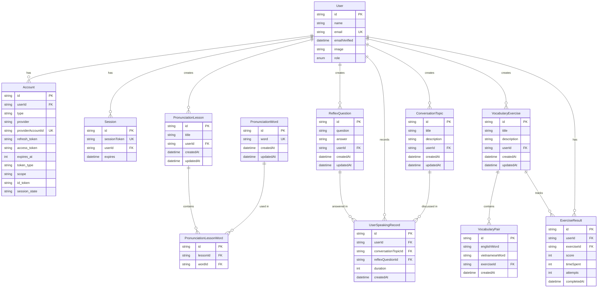

# Sơ đồ Quan hệ Cơ sở Dữ liệu - Hệ thống Quản lý Người dùng

## Mô tả

Sơ đồ dưới đây mô tả mối quan hệ giữa các bảng trong cơ sở dữ liệu của ứng dụng.

## Giải thích Các Quan hệ

### Người dùng và Xác thực

- Một **User** có thể có nhiều **Account** (xác thực bên thứ 3)
- Một **User** có thể có nhiều **Session** (phiên đăng nhập)

### Người dùng và Nội dung

- Một **User** có thể tạo nhiều **PronunciationLesson** (bài học phát âm)
- Một **User** có thể tạo nhiều **ReflexQuestion** (câu hỏi phản xạ)
- Một **User** có thể tạo nhiều **ConversationTopic** (chủ đề hội thoại)
- Một **User** có thể tạo nhiều **VocabularyExercise** (bài tập từ vựng)

### Người dùng và Tiến độ

- Một **User** có thể có nhiều **ExerciseResult** (kết quả bài tập)
- Một **User** có thể ghi lại nhiều **UserSpeakingRecord** (lịch sử nói)

### Bài tập và Câu hỏi

- Một **VocabularyExercise** chứa nhiều **VocabularyPair** (cặp từ vựng)
- Một **VocabularyExercise** có thể có nhiều **ExerciseResult** (kết quả)

### Phiên học

- Một **ReflexQuestion** có thể được trả lời trong nhiều **UserSpeakingRecord**
- Một **ConversationTopic** có thể được thảo luận trong nhiều **UserSpeakingRecord**

## Các Enum

- **Role**: USER, ADMIN
